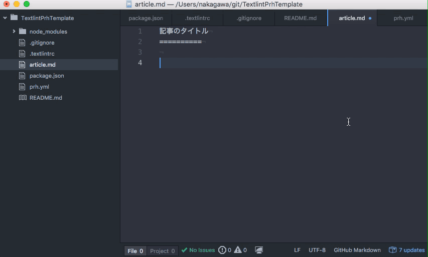

textlint-prh-template
==========

校正候補検出ツールを含む執筆環境のテンプレートです。

article.mdにMarkdownで記事を書いていく際に文章の品質を高め、校正フェーズの負荷を下げることを目的にしています。

校正候補検出ツールについて
----------

校正の手間を減らすために、[textlint](https://github.com/textlint/textlint)と[proofread-helper](https://github.com/vvakame/prh)（通称:prh）を組み合わせて用いて、表記ゆれや開いたほうがよいと思われる表現についてのチェックを行います。

* [textlint](https://github.com/textlint/textlint): 自然言語をチェックする環境を提供するツール
    - 設定ファイル: .textlintrc
* [proofread-helper](https://github.com/vvakame/prh): 校正補助ツール
    - 設定ファイル: prh.yml
    - TechBoosterで校正に使っているルールを採用しました
    - https://github.com/vvakame/prh/blob/c82b776eb6c7f12e2634e5796b9905f8dfdceb9e/misc/techbooster.yml

執筆開始時に行うこと
----------

### ローカルのGitリポジトリを削除する

```
$ rm -rf .git/
```

### textlintルールのインストール

手元にnode.js環境を用意して、このディレクトリのルートで次のコマンドを実行します。

```
$ npm install
```

`node_modules/`に各種モジュールが入ったら、コマンドラインからの校正チェック環境の構築は完了です。

### エディタの準備

Atomに[linter-textlint](https://github.com/1000ch/linter-textlint)プラグインを入れると、検出結果がAtom上の文章で直接指摘されるため、校正すべき点が分かりやすくなります。


